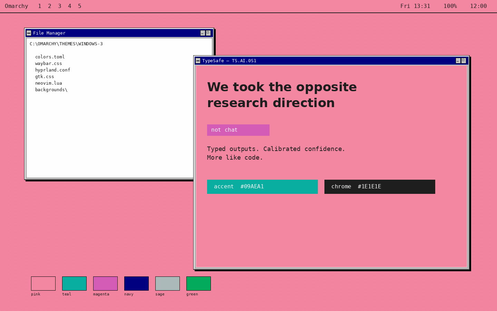

# Windows 3 — Omarchy theme

A light Omarchy theme that restyles the desktop after [TypeSafe AI](https://typesafe.ai/): pink VGA wallpaper, navy title bars, teal accents, magenta selection, and the hard-edged chrome of Windows 3.1.

The theme follows the same file layout as community themes such as Black_Arch (`colors.toml`, terminal configs, Waybar, Walker, GTK, Hyprland, Neovim, wallpapers) and adds Omarchy 3 files (`shell.toml`, `hyprland.lua`, `light.mode`).



## Palette

| Token | Hex | Role |
| --- | --- | --- |
| Pink | `#f386a1` | Desktop, bar, TypeSafe page color |
| Off-white | `#fefefe` | Window interiors, terminals, editors |
| Silver | `#c0c0c0` | Dialogs, menus, Win31 face |
| Navy | `#000080` | Active title bars, keywords |
| Teal | `#09aea1` | Accent, links, success-adjacent chrome |
| Magenta | `#d45bb6` | Selection |
| Ink | `#1e1e1e` | Text and window borders |
| Sage | `#abbab9` | Muted surfaces |
| Green | `#03aa5c` | Success / terminal green |

## Install

```sh
omarchy-theme-install https://github.com/viniciuskr/omarchy-windows-3-theme.git
```

From the Omarchy menu: **Install → Style → Theme**, then paste the same URL.

After install, pick **Windows 3** in the theme selector (`Super + Ctrl + Shift + Space`).

## What you get

- Light-mode Omarchy (`mode = "light"` + `light.mode`)
- Pink TypeSafe wallpapers plus classic Win31 teal, tiles, argyle, and navy-dot desktops
- Square Hyprland windows, 3px ink borders, hard drop shadows
- Waybar as a pink Program Manager strip
- Walker / Mako / SwayOSD as silver Win31 dialogs
- Terminals (Alacritty, Kitty, Ghostty, Foot), btop, Cava, GTK, Firefox, Vencord
- A self-contained Neovim colorscheme named `windows-3`

Regenerate wallpapers and previews with:

```sh
python3 scripts/generate-assets.py
```

## Credits

- Visual language: [typesafe.ai](https://typesafe.ai/)
- Desktop OS: Windows 3.1
- Theme skeleton: [Black_Arch](https://github.com/ankur311sudo/black_arch) community Omarchy theme
- Target environment: [Omarchy](https://omarchy.org)
